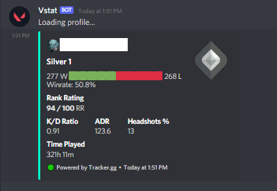

# <h1 align="center"> Valorant Server Status Bot </h> 


A discord bot made with ❤️ 
That can :<br>
<ul>
    <li>Show current server <b>status</b> of valorant for a given region, whether the servers are <b>UP or DOWN</b> </li>
    <li>Show <b> Your ingame SHOP in discord </b> </li>
    <li>Show <b> description of maps </b> </li>
    <li>Show <b> description of agents </b> </li>
    <li>Show <b> information about Weapons</b> </li>   
</ul>

More Things coming... stay tuned to find out :)

## INSTALLATION

make sure to put the necessary keys in `config.json` file [present here](https://github.com/typhonshambo/Valorant-server-stat-bot/blob/main/config/config.json) for the bot to work properly.

```json
{
    "token":"PUT_YOUR_TOKEN_HERE",
    "prefix": "!",
    "database_url":"PUT_YOUR_POSTGRES_DATABASE_URL_HERE"
}
```
### DATABASE NOTE

Here for the bot we are using `POSTGRES SQL DATABASE`, if the database URL is not provided `in config.json` the `shop` command will not work.
If you dont know how to make a postgres database feel free to learn it from youtube or anywhere else. You can also make one postgres SQL DB in heroku
it is easy to do :)

### DATABASE SETUP

Your database must contain a table called `riotpwd` and the table should contain following columns with datatypes :

|  column name             | datatype                                |
| ------------------------ | --------------------------------------- |
| user_id                  | character varying                       |
| username                 | character varying                       |
| password                 | character varying                       |

### COMMANDS INTEGRATED WITH DATABASE

- profile
- rank
 

## COMMAND LIST


|  Command                 | description                             |
| ------------------------ | --------------------------------------- |
| vstat <region_name>      | Shows valorant server of <region_name>  |
| agent <agent_name>       | Shows description of <agent_name>       |
| map <map_name>           | Shows description of <map_name>         |
| weapon <weapon_name>     | Shows description of weapon             |
| invite                   | Invite the bot to your server           |  
| ace                      | send ace sounds of different skins      |
| skin                     | shows info regarding skins              |
| spec                     | shows specs required for valorant       |
| shop                     | shows your valorant shop of you account |
| login                    | Login to you valorant acc to show shop  |
| bunl                     | show list of all available skin bundles |
| bundle <name>            | show info of <name> bundle              |
| rank                     | show rank in valorant                   |
| Profile                  | show your profile (K/d, rank, win rate) |


## REGION LIST
```css
NA      - North America
EU      - Europe
BR      - Brazil
AP      - Asia Pacific
KR      - Korea
LATAM   - Latin America
```

## REQUIRED PACKAGES
 - discord.py
 - valoStatus
 - discord-components
 - asyncpg

you can run these commands in CMD to install the packages
```python
pip install discord.py
```
```python
pip install valoStatus
```
```python
pip install discord-components
```
## Bot Link
here is one ready made bot, which you can add in your server :)

[click here to invite](https://discord.com/api/oauth2/authorize?client_id=864451929346539530&permissions=2885938240&scope=bot)


## SCREENSHOTS

 
 




## SUPPORT SERVER


TYPHON GAMERS [click here](https://discord.gg/m5mSyTV7RR)


## Contributors


## Donation
[](https://www.paypal.me/typhonshambo) - Buy me a coffee ❤️


